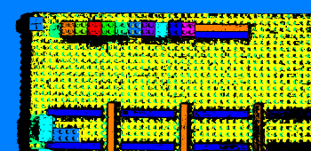

# Hackathon - Lego image processing

This is the code from our hackathon project to process a planning board made out of colored lego blocks.

Beware, the code was written late at night under the influence of a lot of Mate ;)

Example processing images:

---

 

---

 